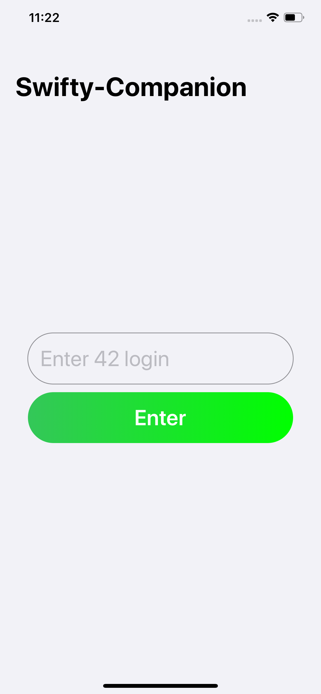
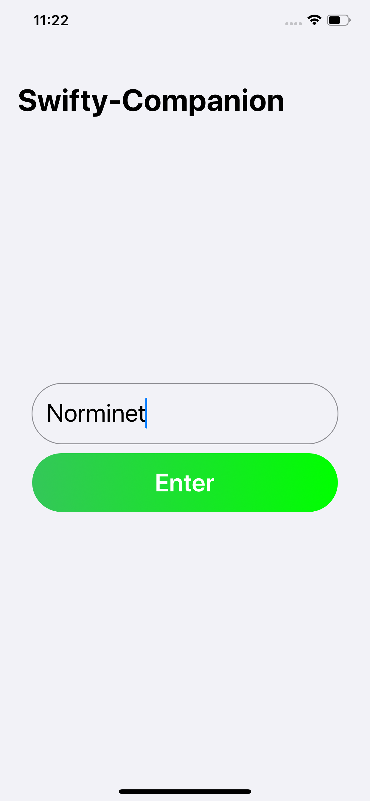
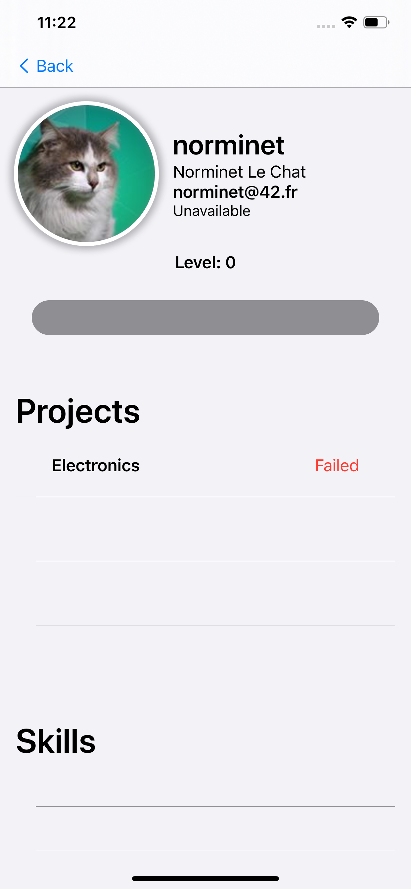

<h1 align="center">
 

 
</h1>

<h3 align="center">Project 42, where we have to create an iOS application from scratch using the api of 42 and OAuth2.</h3>

---

## Description

Swifty Companion is not available on the AppStore because it's a project to learn Swift and Xcode.

This application contain:
 - 42 Api
 - 2 View
 - Search Bar
 - ...

## Technologies

The technologies I used to make this project happen are:
 - SwiftUI
 - Swift 5
 - Xcode 11.4
 - iOS 13.4
 - OAuth2 Framework

## Bonus

 - Dark Mode
 - Design View
 - Custom Cell
 - Custom Scroll View
 - Custom Pop Up

---

## Views

